# BandaPixel-nodejs-test
Published: https://bandapixel-test.herokuapp.com

## Need to create REST API server with bearer token auth.
- [x] Setup `CORS` to allow access from any domain. 
- [x] DB - any. (I chose MySQL)
- [x] Token should have expiration time 10 mins and extend it on any user request (except `singin`/`logout`)
### --- API endpoints ---
- [x] /signin [POST] - request for bearer token by `id` and `password`
- [x] /signup [POST] - creation of new user
	- Fields `id` and `password`. `Id` - phone number or email. After signup add field `id_type` - phone or email
	-	In case of successful signup - return token
- [x] /info [GET] - returns user id and id type
- [x] /latency [GET] - returns service server latency for `google.com`
- [x] /logout [GET] - with param `all`:
    -	`true` - removes all users bearer tokens
    -	`false` - removes only current token
    
## Additional from myself
- [x] Accesses by token middleware
- [x] Auto refresh token cleaner from DB
- [x] Error Handler Middleware
- [x] Add monitoring app integration (Mezmo)
- [x] Auto publish from Github to Heroku

### Not yet
- [ ] TypeScript
- [ ] Tests (jest + supertest)
- [ ] CI/CD
- [ ] Docker

# How to start app
1) Clone project
2) Create `environment variables` or create file `.env` with same fields
```
PORT=

DB_DATABASE=
DB_HOST=
DB_PASSWORD=
DB_USER=

JWT_ACCESS_SECRET=
JWT_REFRESH_SECRET=
```
3) `npm install`
4) For create tables - run `resetDatabases()` method from `utils.js`
5) Then start project by commands:
```
npm start
```
or for dev
```
npm run serve
```

# API
## /signin [POST]
**Params:**
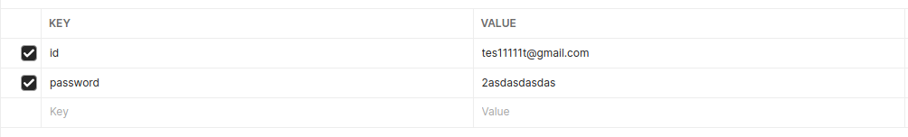

**Output:**
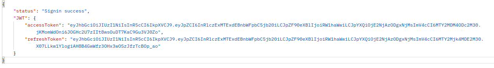

## /signup [POST]
**Params:**
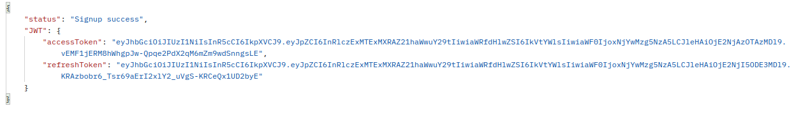

**Output:**


## /info [GET]
`Authorization required`
**Params:**
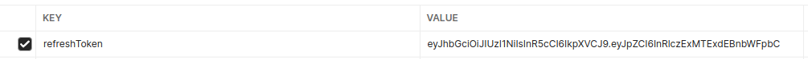

**Output:**
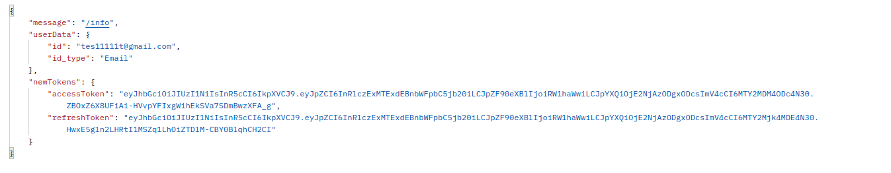

## /latency [GET]
`Authorization required`
**Params:**


**Output:**
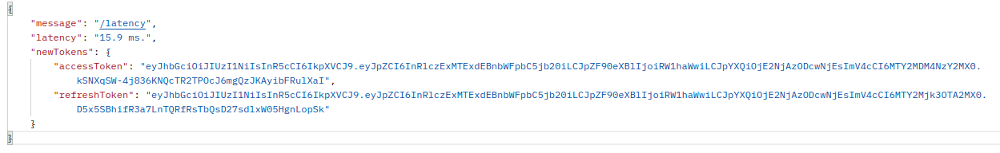

## /logout [GET]
`Authorization required`
**Params:**
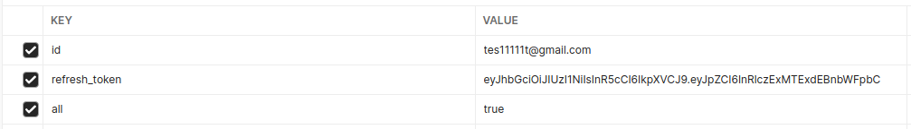

**Output:**
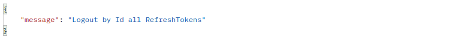

## Authorization
For this page you must use Bearer jwt access token in header. 
And send refresh token, if you need to refresh it.

# Work flow
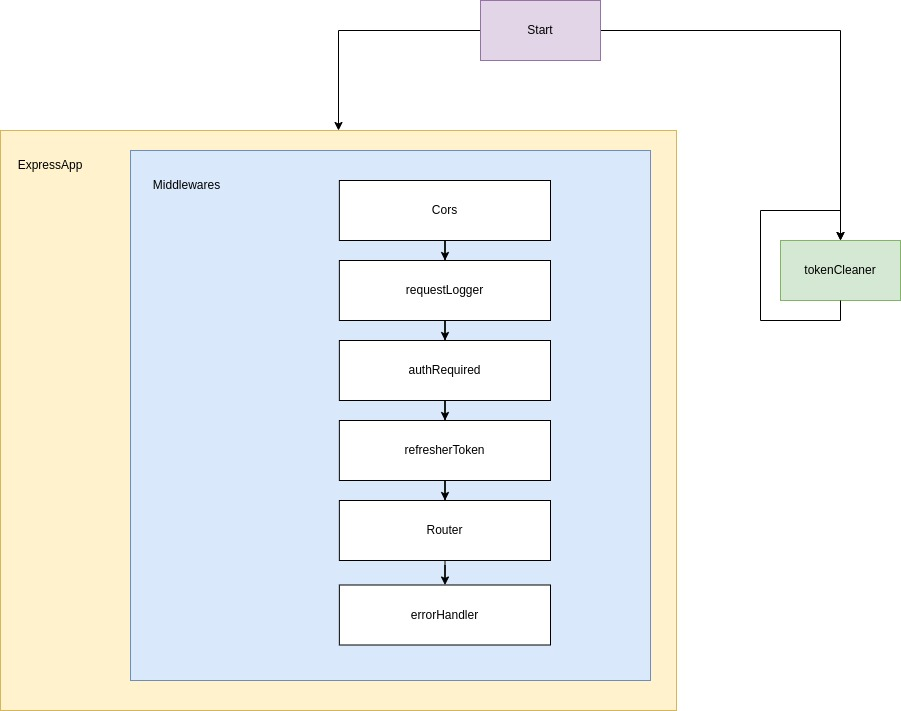

## Router flow
_Coming soon_

# Database diagram
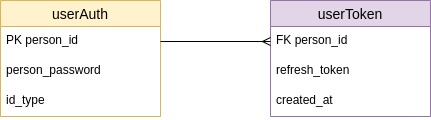

# Monitoring by Mezmo

## Base logs
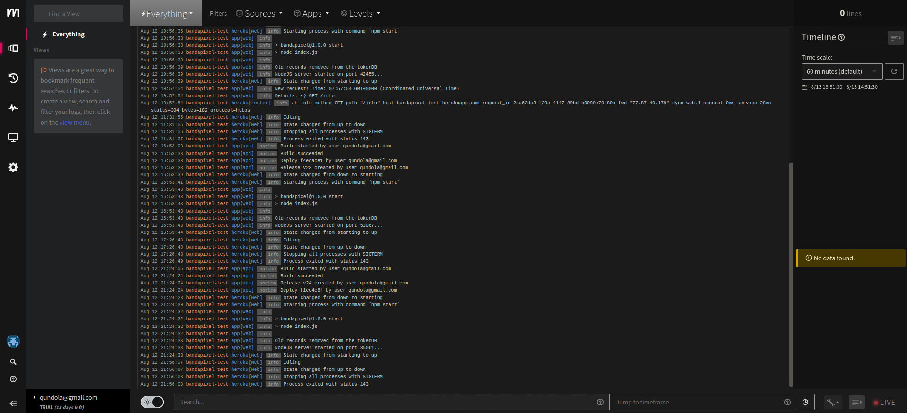

## Charts logs


## Base logs

